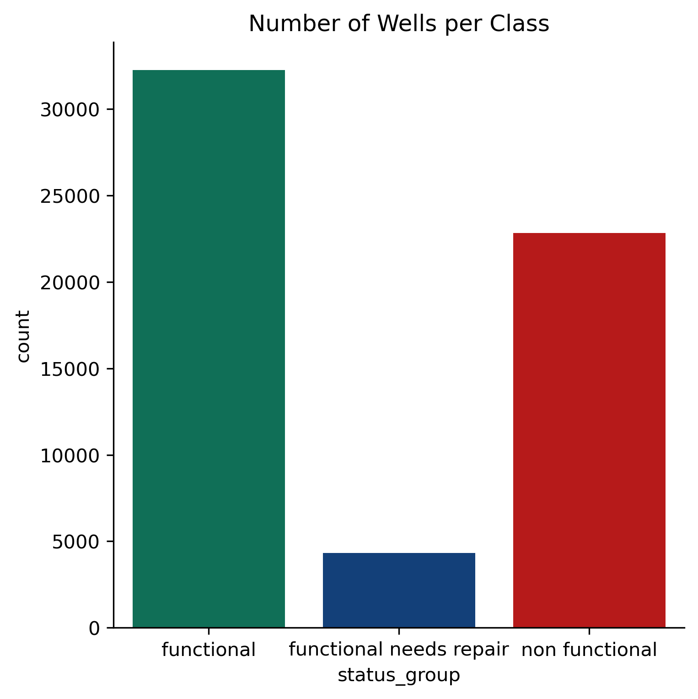

Our project was to create a model that could predict the faultiness of water wells in Tanzania. Our analysis was completed with the hopes of providing insight to those with a vested interest, be they financial or social, in improving water accessibility in Tanzania.

This project employs data sets from the Tanzanian Ministry of Water and Taarifa.

Random Forest Tree, a supervised Machine Learning Algorithm, is the classifier we used to create our final model.

After dowloading the data set, we began on a thorough data cleaning process using the Python tool Pandas. First, we needed to get rid of as many missing (NA) values as possible. Where possible, we utlized inferential statistics and imputed some of the missing values. Obviously, this is not always an option, so we ridded ourselves of the NA values using standard DA

This is a map of Tanzania that revelas the location of every water well in the country. The wells in blue are totally functional. The ones in light blue need repairs. The ones in red are no longer functional. This is consistent with our decision to create three classes of water wells: Functional, In need of repair, and non functional. This graph is pretty self explanatory, as it simply shows the number of wells per class.

Here, we created a graph that revealed the ratio of functionality per well type.

Here is a confusion matrix for our model. The number in the bottom left corner, represents the recall score for non functional wells. We wanted to maximize that score, since this is truly what determines how well our model could predict the faultiness of the water wells.

Moving forward, we would love to be able to examine, geographical and topographical indicators of water well faultiness. Salinity, is another indicator that would be useful to study, especially given the prevalence of insufficient water wells along the east coast of Tanzania, which borders the Indian Ocean (one of the largest bodies of saltwater in the world).

